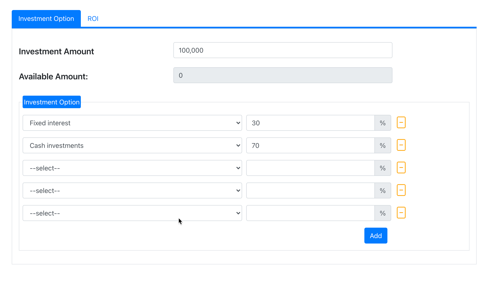
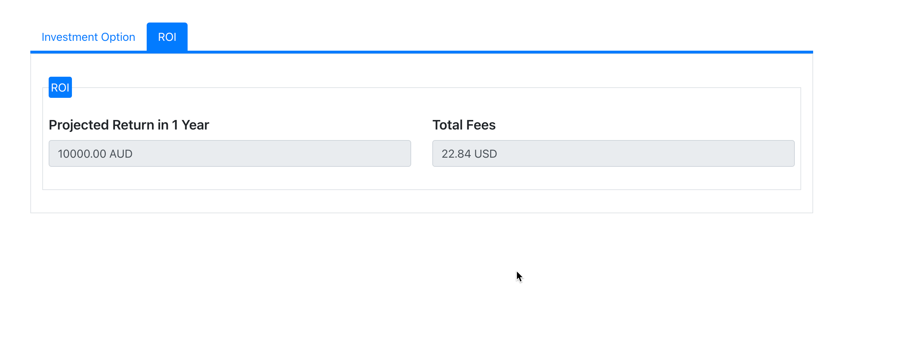

## Investment Option Checker

#### Folder structure

-   InvestCalcService (ASP.Net Core Web API project which provides the Investment Option Calculation service for client)
-   invest-calc-app (SPA React web app for user to input investment option and get the calculation result)

#### Backend (How to run)

> cd InvestCalcService && dotnet run InvestCalcService.csproj

#### Frontend

> cd invest-calc-app && yarn start

